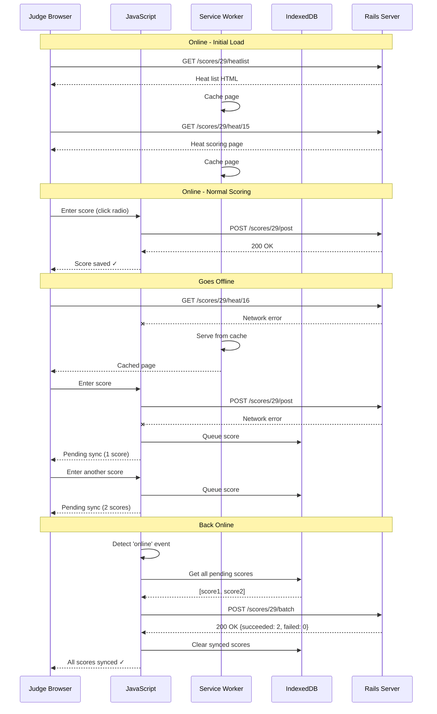

# Offline Scoring Implementation Plan

**Status:** Service Worker Implementation Complete - Exploring SPA Alternative
**Last Updated:** 2025-01-05
**Authors:** Sam Ruby, Claude Code

## Table of Contents

- [Overview](#overview)
- [Architecture](#architecture)
- [Technology Stack](#technology-stack)
- [Implementation Phases](#implementation-phases)
- [Data Synchronization](#data-synchronization)
- [Security Considerations](#security-considerations)
- [Testing Strategy](#testing-strategy)
- [Performance Considerations](#performance-considerations)
- [Deployment and Rollout](#deployment-and-rollout)
- [Future Enhancements](#future-enhancements)

---

## Overview

### Goal

Enable judges to continue scoring heats when internet connectivity is lost during an event. Scores should be saved locally and automatically synchronized via a single batch update when connectivity resumes.

### Use Case

A judge navigates to their heat list (e.g., `http://localhost:3000/scores/29/heatlist`), begins scoring heats, and can continue working even if internet connectivity is interrupted. Upon reconnection, all pending scores are uploaded to the server in a single batch request.

### Key Design Decisions

1. **Batch synchronization**: When online, scores save normally (one at a time). When reconnecting after offline period, all queued scores submit in a single batch.
2. **Service worker for caching only**: Caches pages for offline viewing, but does NOT intercept POST requests.
3. **JavaScript-based queuing**: Regular JavaScript catches fetch failures and queues to IndexedDB.
4. **Single batch endpoint**: New `/scores/:judge/batch` endpoint accepts array of scores.
5. **No merge conflicts**: Each judge creates their own scores, eliminating conflict scenarios.

### Approach Summary

```
Online:  User scores → POST /scores/:judge/post → Immediate save ✓
         (Current behavior, unchanged)

Offline: User scores → POST fails → Save to IndexedDB → Show "Pending" indicator
         (New: catch network error, queue locally)

Back Online: Auto-detect → POST /scores/:judge/batch → Sync all queued scores ✓
             (New: single batch request)
```

---

## Architecture

### High-Level Flow



### Component Architecture

```
┌─────────────────────────────────────────────────────────────┐
│                      Browser (Judge's Device)                │
├─────────────────────────────────────────────────────────────┤
│  UI Layer                                                    │
│  ├─ Heatlist View (scores#heatlist) - unchanged             │
│  ├─ Heat Scoring View (scores#heat) - unchanged             │
│  └─ Offline Indicator Component (new)                       │
├─────────────────────────────────────────────────────────────┤
│  JavaScript Layer                                            │
│  ├─ score_controller.js (modified: catch fetch errors)      │
│  ├─ offline_controller.js (new: status & sync button)       │
│  ├─ db_manager.js (new: IndexedDB operations)               │
│  └─ sync_manager.js (new: batch submission)                 │
├─────────────────────────────────────────────────────────────┤
│  Service Worker (Simple - Caching Only)                     │
│  └─ Cache GET requests to /scores/* paths                   │
│      Network-first strategy, cache fallback                 │
│      Does NOT intercept POST requests                       │
├─────────────────────────────────────────────────────────────┤
│  Storage Layer                                               │
│  ├─ Cache Storage: HTML pages, CSS, JS                      │
│  └─ IndexedDB: Pending scores only                          │
└─────────────────────────────────────────────────────────────┘
                            │
                            ▼
┌─────────────────────────────────────────────────────────────┐
│                      Rails Server                            │
├─────────────────────────────────────────────────────────────┤
│  New Endpoint                                                │
│  └─ POST /scores/:judge/batch                               │
│      Accepts: { scores: [...] }                             │
│      Returns: { succeeded: [...], failed: [...] }           │
│                                                              │
│  Existing Endpoint (Unchanged)                               │
│  └─ POST /scores/:judge/post                                │
│      Single score submission                                │
└─────────────────────────────────────────────────────────────┘
```

---

## Technology Stack

### Service Worker (Simple)

- **Purpose**: Cache pages for offline viewing only
- **Strategy**: Network-first with cache fallback
- **Scope**: `/scores/` paths only
- **Does NOT**: Intercept POST requests or handle queuing

### JavaScript (Primary Logic)

- **Purpose**: Detect offline state, queue scores, trigger sync
- **Strategy**: Wrap fetch in try/catch; on error, save to IndexedDB
- **Libraries**: Native fetch, IndexedDB, Stimulus controllers

### IndexedDB

- **Purpose**: Store pending scores locally
- **Schema**:
  ```javascript
  // Store: pending_scores
  {
    id: "1698012345678-abc123",  // timestamp + random
    judge_id: 29,
    heat: 15,
    slot: 1,
    score: "1",
    comments: "Great posture",
    good: "frame posture",
    bad: "",
    timestamp: 1698012345678
  }
  ```
- **Size**: ~200 bytes per score, 100 scores = ~20KB

### Rails Server (Modified)

- **New Endpoint**: `POST /scores/:judge/batch`
- **Purpose**: Accept array of scores, process with partial failure handling
- **Response Format**:
  ```json
  {
    "succeeded": [
      {"heat_id": 15, "slot": 1, "queue_id": "1698012345678-abc123"}
    ],
    "failed": [
      {"heat_id": 16, "slot": 1, "queue_id": "1698012346789-def456", "error": "Heat not found"}
    ]
  }
  ```

### Browser APIs Used

- **`navigator.onLine`**: Detect online/offline state
- **`online`/`offline` events**: React to connectivity changes
- **IndexedDB**: Local storage for pending scores
- **Service Worker**: Page caching
- **Fetch API**: HTTP requests with error handling

---

## Implementation Phases

### Phase 1: Service Worker & Caching (2-3 hours)

**Goal**: Enable offline page viewing

#### Tasks

1. **Create Service Worker** (`public/service-worker.js`)
   ```javascript
   const CACHE_NAME = 'showcase-scores-v1';
   const URLS_TO_CACHE = [
     '/assets/application.css',
     '/assets/application.js'
   ];

   // Install: pre-cache assets
   self.addEventListener('install', event => {
     event.waitUntil(
       caches.open(CACHE_NAME)
         .then(cache => cache.addAll(URLS_TO_CACHE))
     );
   });

   // Fetch: network-first for /scores/ pages
   self.addEventListener('fetch', event => {
     if (event.request.method !== 'GET') return;
     if (!event.request.url.includes('/scores/')) return;

     event.respondWith(
       fetch(event.request)
         .then(response => {
           const clone = response.clone();
           caches.open(CACHE_NAME).then(cache => {
             cache.put(event.request, clone);
           });
           return response;
         })
         .catch(() => caches.match(event.request))
     );
   });
   ```

2. **Create Service Worker Controller** (`app/javascript/controllers/service_worker_controller.js`)
   ```javascript
   import { Controller } from "@hotwired/stimulus"

   export default class extends Controller {
     connect() {
       if ('serviceWorker' in navigator) {
         navigator.serviceWorker.register('/service-worker.js')
           .then(reg => {
             console.log('Service Worker registered');
             this.serviceWorkerRegistration = reg;
           })
           .catch(err => console.error('Service Worker failed:', err));
       }
     }

     disconnect() {
       // Cleanup if needed
     }
   }
   ```

3. **Add to Scores Layout** (`app/views/scores/heatlist.html.erb`)
   ```erb
   <div data-controller="service-worker"></div>
   ```

4. **Test Caching**
   - Visit heatlist online
   - Visit 3 heat pages
   - Go offline (DevTools → Network → Offline)
   - Navigate back/forward between visited heats
   - Verify pages load from cache

**Deliverables**:
- Service worker registered for /scores/ paths
- Service worker controller manages registration
- Pages cached and viewable offline
- Browser console shows "Service Worker registered"

**Testing**:
- [ ] Service worker registers without errors
- [ ] Navigate to heat pages while online
- [ ] Go offline, verify back button works
- [ ] Try visiting new heat offline (should fail - not prefetched yet)

---

### Phase 2: IndexedDB Manager (1-2 hours)

**Goal**: Create helper for storing/retrieving pending scores

#### Tasks

1. **Create DB Manager** (`app/javascript/helpers/db_manager.js`)
   ```javascript
   const DB_NAME = 'showcase_offline';
   const DB_VERSION = 1;
   const STORE_NAME = 'pending_scores';

   class DBManager {
     async open() {
       return new Promise((resolve, reject) => {
         const request = indexedDB.open(DB_NAME, DB_VERSION);

         request.onerror = () => reject(request.error);
         request.onsuccess = () => resolve(request.result);

         request.onupgradeneeded = (event) => {
           const db = event.target.result;
           if (!db.objectStoreNames.contains(STORE_NAME)) {
             const store = db.createObjectStore(STORE_NAME, { keyPath: 'id' });
             store.createIndex('judge_id', 'judge_id', { unique: false });
             store.createIndex('timestamp', 'timestamp', { unique: false });
           }
         };
       });
     }

     async addScore(scoreData) {
       const db = await this.open();
       const id = `${Date.now()}-${Math.random().toString(36).substr(2, 9)}`;

       return new Promise((resolve, reject) => {
         const tx = db.transaction(STORE_NAME, 'readwrite');
         const store = tx.objectStore(STORE_NAME);
         const score = { id, ...scoreData, timestamp: Date.now() };

         const request = store.add(score);
         request.onsuccess = () => resolve(score);
         request.onerror = () => reject(request.error);
       });
     }

     async getPendingScores(judgeId) {
       const db = await this.open();
       return new Promise((resolve, reject) => {
         const tx = db.transaction(STORE_NAME, 'readonly');
         const store = tx.objectStore(STORE_NAME);
         const index = store.index('judge_id');
         const request = index.getAll(judgeId);

         request.onsuccess = () => resolve(request.result);
         request.onerror = () => reject(request.error);
       });
     }

     async getPendingCount(judgeId) {
       const scores = await this.getPendingScores(judgeId);
       return scores.length;
     }

     async deleteScore(queueId) {
       const db = await this.open();
       return new Promise((resolve, reject) => {
         const tx = db.transaction(STORE_NAME, 'readwrite');
         const store = tx.objectStore(STORE_NAME);
         const request = store.delete(queueId);

         request.onsuccess = () => resolve();
         request.onerror = () => reject(request.error);
       });
     }

     async clearAll(judgeId) {
       const scores = await this.getPendingScores(judgeId);
       for (const score of scores) {
         await this.deleteScore(score.id);
       }
     }
   }

   window.dbManager = new DBManager();
   ```

2. **Import in Application** (`app/javascript/application.js`)
   ```javascript
   import "./helpers/db_manager"
   ```

**Deliverables**:
- IndexedDB database created
- CRUD operations for pending scores
- Global `window.dbManager` available

**Testing**:
- [ ] Open browser console
- [ ] Run: `await dbManager.addScore({judge_id: 29, heat: 15, score: "1"})`
- [ ] Run: `await dbManager.getPendingScores(29)`
- [ ] Verify score returned
- [ ] Check IndexedDB in DevTools → Application → IndexedDB

---

### Phase 3: Prefetching & Offline Indicator UI (2-3 hours)

**Goal**: Prefetch all heats for judge and show connection status

#### Tasks

1. **Add Prefetching to Service Worker Controller** (`app/javascript/controllers/service_worker_controller.js`)

   Update the existing controller to handle prefetching:

   ```javascript
   import { Controller } from "@hotwired/stimulus"

   export default class extends Controller {
     static values = {
       judgeId: Number,
       heatNumbers: Array
     }

     connect() {
       if ('serviceWorker' in navigator) {
         navigator.serviceWorker.register('/service-worker.js')
           .then(reg => {
             console.log('Service Worker registered');
             this.serviceWorkerRegistration = reg;

             // If we have heat data, prefetch
             if (this.hasHeatNumbersValue && this.hasJudgeIdValue) {
               this.prefetchHeats();
             }
           })
           .catch(err => console.error('Service Worker failed:', err));
       }
     }

     async prefetchHeats() {
       const registration = await navigator.serviceWorker.ready;

       if (!registration.active) {
         console.error('Service worker not active yet');
         return;
       }

       // Build URLs for all heats
       const urls = this.heatNumbersValue.map(number =>
         `/scores/${this.judgeIdValue}/heat/${number}`
       );

       console.log(`Prefetching ${urls.length} heats for judge ${this.judgeIdValue}...`);

       // Send prefetch request to service worker
       registration.active.postMessage({
         type: 'PREFETCH_HEATS',
         urls: urls
       });
     }

     disconnect() {
       // Cleanup if needed
     }
   }
   ```

2. **Update Service Worker to Handle Prefetch Messages** (`public/service-worker.js`)

   Add message handler after the fetch listener:

   ```javascript
   // Handle messages from page
   self.addEventListener('message', event => {
     if (event.data.type === 'PREFETCH_HEATS') {
       const urls = event.data.urls;

       console.log('Service worker prefetching', urls.length, 'URLs');

       event.waitUntil(
         caches.open(CACHE_NAME).then(async cache => {
           // Fetch and cache all URLs in background
           // Use Promise.allSettled to continue even if some fail
           const results = await Promise.allSettled(
             urls.map(url =>
               fetch(url)
                 .then(response => {
                   if (response.ok) {
                     return cache.put(url, response);
                   }
                   throw new Error(`Failed to fetch ${url}: ${response.status}`);
                 })
             )
           );

           const succeeded = results.filter(r => r.status === 'fulfilled').length;
           const failed = results.filter(r => r.status === 'rejected').length;

           console.log(`Prefetch complete: ${succeeded} succeeded, ${failed} failed`);
         })
       );
     }
   });
   ```

3. **Update Heatlist View** (`app/views/scores/heatlist.html.erb`)

   Add data attributes for the service worker controller:

   ```erb
   <div data-controller="service-worker"
        data-service-worker-judge-id-value="<%= @judge.id %>"
        data-service-worker-heat-numbers-value="<%= @heats.map(&:number).to_json %>">
   </div>
   ```

4. **Create Offline Controller** (`app/javascript/controllers/offline_controller.js`)
   ```javascript
   import { Controller } from "@hotwired/stimulus"

   export default class extends Controller {
     static targets = ["status", "count", "syncButton", "message"]

     connect() {
       this.judgeId = this.getJudgeId();
       this.updateStatus();
       this.updateCount();

       window.addEventListener('online', () => this.goOnline());
       window.addEventListener('offline', () => this.goOffline());
       document.addEventListener('score-queued', () => this.updateCount());

       this.checkPendingOnLoad();
     }

     disconnect() {
       window.removeEventListener('online', () => this.goOnline());
       window.removeEventListener('offline', () => this.goOffline());
     }

     getJudgeId() {
       const match = window.location.pathname.match(/\/scores\/(\d+)/);
       return match ? parseInt(match[1]) : null;
     }

     updateStatus() {
       const online = navigator.onLine;
       this.statusTarget.textContent = online ? '●' : '●';
       this.statusTarget.className = online ?
         'text-green-500 text-xl' : 'text-red-500 text-xl';
     }

     async updateCount() {
       if (!this.judgeId) return;

       const count = await window.dbManager.getPendingCount(this.judgeId);
       this.countTarget.textContent = count;
       this.element.hidden = count === 0;
     }

     async checkPendingOnLoad() {
       if (!this.judgeId) return;

       const count = await window.dbManager.getPendingCount(this.judgeId);
       if (count > 0 && navigator.onLine) {
         this.messageTarget.textContent = `${count} pending scores detected`;
         setTimeout(() => this.sync(), 1500);
       }
     }

     async goOnline() {
       this.updateStatus();

       setTimeout(async () => {
         const count = await window.dbManager.getPendingCount(this.judgeId);
         if (count > 0) {
           this.messageTarget.textContent = 'Connection restored, syncing...';
           await this.sync();
         }
       }, 1000);
     }

     goOffline() {
       this.updateStatus();
       this.updateCount();
     }

     async sync() {
       if (!this.judgeId) return;

       this.syncButtonTarget.disabled = true;
       this.messageTarget.textContent = 'Syncing...';

       const result = await window.syncManager.syncQueuedScores(this.judgeId);

       if (result.success) {
         if (result.succeeded > 0) {
           this.messageTarget.textContent = `✓ ${result.succeeded} scores synced`;
           setTimeout(() => {
             this.messageTarget.textContent = '';
             this.updateCount();
           }, 3000);
         }

         if (result.failed > 0) {
           this.messageTarget.textContent = `⚠ ${result.failed} scores failed. See console for details.`;
           console.error('Failed scores:', result.details.failed);
         }
       } else {
         this.messageTarget.textContent = `✗ Sync failed: ${result.message}`;
       }

       this.syncButtonTarget.disabled = false;
       await this.updateCount();
     }
   }
   ```

5. **Create View Partial** (`app/views/shared/_offline_indicator.html.erb`)
   ```erb
   <div data-controller="offline"
        class="fixed bottom-4 right-4 z-50 hidden bg-white rounded-lg shadow-lg p-4 max-w-sm border-2 border-gray-200">
     <div class="flex items-center justify-between mb-2">
       <div class="flex items-center gap-2">
         <span data-offline-target="status" class="text-green-500 text-xl">●</span>
         <span class="font-semibold text-sm">
           <span data-offline-target="count">0</span> scores pending
         </span>
       </div>
       <button data-action="click->offline#sync"
               data-offline-target="syncButton"
               class="px-3 py-1 bg-blue-500 text-white text-xs rounded hover:bg-blue-600 disabled:bg-gray-300 disabled:cursor-not-allowed transition">
         Sync Now
       </button>
     </div>
     <div data-offline-target="message" class="text-xs text-gray-600 min-h-[16px]"></div>
   </div>
   ```

6. **Include in Layout** (`app/views/layouts/application.html.erb`)
   ```erb
   <%= render 'shared/offline_indicator' if controller_name == 'scores' && action_name != 'index' %>
   ```

**Deliverables**:
- Service worker prefetches all heats when heatlist loads
- Offline indicator banner
- Shows online/offline status (green/red dot)
- Shows pending score count
- Sync Now button
- Hidden when no pending scores

**Testing**:
- [ ] Visit heatlist, check console for "Prefetching X heats..."
- [ ] Wait 10-30 seconds for prefetch to complete
- [ ] Check DevTools → Application → Cache Storage → verify heat pages cached
- [ ] Go offline in DevTools
- [ ] Navigate to heat 37 (not visited yet) → should load from cache ✓
- [ ] Toggle offline, verify red dot appears
- [ ] Manually add score to IndexedDB, verify banner appears
- [ ] Click Sync Now, verify it calls sync method

---

### Phase 4: Score Queuing (2-3 hours)

**Goal**: Queue scores in IndexedDB when POST fails

#### Tasks

1. **Modify Score Controller** (`app/javascript/controllers/score_controller.js`)

   Find the existing `post` method and wrap it:

   ```javascript
   post = results => {
     return fetch(this.element.dataset.dropAction, {
       method: "POST",
       headers: window.inject_region({
         "X-CSRF-Token": this.token,
         "Content-Type": "application/json"
       }),
       credentials: "same-origin",
       redirect: "follow",
       body: JSON.stringify(results)
     }).then(response => {
       let error = this.errorTarget;

       if (response.ok) {
         error.style.display = "none";
         return response;
       } else {
         error.textContent = response.statusText;
         error.style.display = "block";
         return response;
       }
     }).catch(async err => {
       // Network error - we're offline!
       console.log('Score submission failed (offline), queueing...', err);

       // Get judge_id from URL
       const judgeId = this.getJudgeId();
       if (!judgeId) {
         console.error('Could not determine judge ID');
         return;
       }

       // Queue score in IndexedDB
       try {
         await window.dbManager.addScore({
           judge_id: judgeId,
           heat: results.heat,
           slot: results.slot,
           score: results.score,
           comments: results.comments,
           good: results.good,
           bad: results.bad
         });

         // Notify UI
         document.dispatchEvent(new CustomEvent('score-queued'));

         // Keep yellow highlight (score not confirmed by server)
         // Return success so UI doesn't show error
         return new Response(JSON.stringify({ queued: true }), {
           status: 200,
           headers: { 'Content-Type': 'application/json' }
         });
       } catch (dbError) {
         console.error('Failed to queue score:', dbError);
         throw dbError;
       }
     });
   };

   getJudgeId() {
     // Extract from URL: /scores/29/heat/15 → 29
     const match = window.location.pathname.match(/\/scores\/(\d+)/);
     return match ? parseInt(match[1]) : null;
   }
   ```

2. **Test Queuing**
   - Go offline
   - Enter score via radio button
   - Enter score via drag-and-drop
   - Enter comment
   - Verify all saved to IndexedDB
   - Verify banner shows count incrementing

**Deliverables**:
- Scores queue to IndexedDB on network failure
- Offline indicator count increments
- Yellow highlight remains (score pending)
- No error message shown to user

**Testing**:
- [ ] Go offline
- [ ] Click radio button to select score
- [ ] Check IndexedDB has new entry
- [ ] Verify banner shows "1 scores pending"
- [ ] Enter 3 more scores
- [ ] Verify banner shows "4 scores pending"
- [ ] Drag-and-drop a score
- [ ] Add a comment
- [ ] Verify all queued correctly

---

### Phase 5: Batch Endpoint (2 hours)

**Goal**: Create server endpoint to accept batch submissions

#### Tasks

1. **Add Route** (`config/routes.rb`)
   ```ruby
   post '/scores/:judge/batch', to: 'scores#batch', as: 'batch_scores'
   ```

2. **Extract Shared Score Update Logic** (`app/controllers/scores_controller.rb`)

   Add a private method that both `post` and `batch` can use:

   ```ruby
   private

   # Shared logic for updating or deleting a score
   # Returns: { success: true/false, error: nil/string, deleted: true/false }
   def update_or_delete_score(score, score_params, heat)
     # Update fields if present
     if score_params.key?(:score)
       if score_params[:name] && heat.category == 'Solo' && Event.current.solo_scoring == '4'
         # Solo heats with 4-part scoring use JSON
         value = score.value&.start_with?('{') ? JSON.parse(score.value) : {}
         value[score_params[:name]] = score_params[:score]
         score.value = value.to_json
       else
         score.value = score_params[:score]
       end
     end

     score.comments = score_params[:comments] if score_params.key?(:comments)
     score.good = score_params[:good] if score_params.key?(:good)
     score.bad = score_params[:bad] if score_params.key?(:bad)

     # Clear empty values
     score.comments = nil if score.comments.blank?
     score.good = nil if score.good.blank?
     score.bad = nil if score.bad.blank?
     score.value = nil if score.value.blank?

     # Determine if we should keep this score
     keep = score.good || score.bad || score.comments.present? || score.value.present? ||
            Event.current.assign_judges > 0

     if keep
       if score.save
         { success: true, deleted: false }
       else
         { success: false, error: score.errors.full_messages.join(', '), deleted: false }
       end
     else
       # Delete empty scores (unless assign_judges enabled)
       score.destroy
       { success: true, deleted: true }
     end
   end
   ```

3. **Implement Batch Action Using Shared Logic** (`app/controllers/scores_controller.rb`)
   ```ruby
   def batch
     judge = Person.find(params[:judge].to_i)
     results = { succeeded: [], failed: [] }

     retry_transaction do
       (params[:scores] || []).each do |score_params|
         begin
           heat = Heat.find(score_params[:heat].to_i)
           slot = score_params[:slot]&.to_i

           # Use existing idempotent logic (already in #post at line 363)
           score = Score.find_or_create_by(
             judge_id: judge.id,
             heat_id: heat.id,
             slot: slot
           )

           # Use shared update logic
           result = update_or_delete_score(score, score_params, heat)

           if result[:success]
             results[:succeeded] << {
               heat_id: heat.id,
               slot: slot,
               queue_id: score_params[:queue_id],
               deleted: result[:deleted]
             }
           else
             results[:failed] << {
               heat_id: heat.id,
               slot: slot,
               queue_id: score_params[:queue_id],
               error: result[:error]
             }
           end

         rescue ActiveRecord::RecordNotFound => e
           results[:failed] << {
             heat_id: score_params[:heat],
             slot: score_params[:slot],
             queue_id: score_params[:queue_id],
             error: "Heat not found"
           }
         rescue => e
           results[:failed] << {
             heat_id: score_params[:heat],
             slot: score_params[:slot],
             queue_id: score_params[:queue_id],
             error: e.message
           }
         end
       end
     end

     render json: results
   end
   ```

4. **Optionally Refactor `post` Method** (Future work)

   The existing `post` method could be refactored to use `update_or_delete_score`, but that's not required for offline scoring. The batch endpoint using the shared logic is sufficient.

5. **Test Endpoint**
   ```bash
   # Via curl or Postman
   curl -X POST http://localhost:3000/scores/29/batch \
     -H "Content-Type: application/json" \
     -H "X-CSRF-Token: ..." \
     -d '{
       "scores": [
         {"queue_id": "test1", "heat": 15, "slot": 1, "score": "1"},
         {"queue_id": "test2", "heat": 16, "slot": 1, "score": "2"}
       ]
     }'
   ```

**Deliverables**:
- Shared `update_or_delete_score` method
- `/scores/:judge/batch` endpoint functional
- Accepts array of scores
- Returns success/failure details per score
- Uses existing `find_or_create_by` logic (idempotent)
- Handles score deletion (empty scores)
- Supports Solo 4-part scoring
- Respects `assign_judges` setting

**Testing**:
- [ ] Test with 1 score
- [ ] Test with 10 scores
- [ ] Test with invalid heat ID (should partially succeed)
- [ ] Test with duplicate submissions (should be idempotent)
- [ ] Test with empty score (should delete row)
- [ ] Test with comment-only score (should keep row)
- [ ] Test with Solo 4-part scoring (if applicable)
- [ ] Verify all valid scores saved to database
- [ ] Check response format matches expected JSON
- [ ] Verify deleted scores return `deleted: true` in response

---

### Phase 6: Sync Manager (2-3 hours)

**Goal**: Implement batch synchronization logic

#### Tasks

1. **Create Sync Manager** (`app/javascript/helpers/sync_manager.js`)
   ```javascript
   class SyncManager {
     constructor(dbManager) {
       this.dbManager = dbManager;
       this.syncing = false;
     }

     async syncQueuedScores(judgeId) {
       if (this.syncing) {
         console.log('Sync already in progress');
         return { success: false, message: 'Sync in progress' };
       }

       this.syncing = true;

       try {
         // Get all pending scores
         const pendingScores = await this.dbManager.getPendingScores(judgeId);

         if (pendingScores.length === 0) {
           return {
             success: true,
             succeeded: 0,
             failed: 0,
             message: 'No scores to sync'
           };
         }

         console.log(`Syncing ${pendingScores.length} scores...`);

         // Get CSRF token
         const token = document.querySelector('meta[name="csrf-token"]').content;

         // Submit batch
         const response = await fetch(`/scores/${judgeId}/batch`, {
           method: 'POST',
           headers: {
             'X-CSRF-Token': token,
             'Content-Type': 'application/json'
           },
           credentials: 'same-origin',
           body: JSON.stringify({
             scores: pendingScores.map(score => ({
               queue_id: score.id,
               heat: score.heat,
               slot: score.slot,
               score: score.score,
               comments: score.comments,
               good: score.good,
               bad: score.bad
             }))
           })
         });

         // Handle session timeout
         if (response.status === 401) {
           return {
             success: false,
             message: 'Session expired. Please refresh the page to log in again. Your scores are saved and will sync after login.'
           };
         }

         // Handle server errors
         if (!response.ok) {
           throw new Error(`Server error: ${response.status} ${response.statusText}`);
         }

         const results = await response.json();

         // Remove succeeded scores from IndexedDB
         for (const success of results.succeeded) {
           await this.dbManager.deleteScore(success.queue_id);
         }

         // Log failures but don't remove (will retry)
         if (results.failed.length > 0) {
           console.error('Some scores failed to sync:', results.failed);
         }

         return {
           success: true,
           succeeded: results.succeeded.length,
           failed: results.failed.length,
           details: results
         };

       } catch (error) {
         console.error('Sync failed:', error);
         return {
           success: false,
           message: error.message
         };
       } finally {
         this.syncing = false;
       }
     }
   }

   // Create global instance
   window.syncManager = new SyncManager(window.dbManager);
   ```

2. **Import in Application** (`app/javascript/application.js`)
   ```javascript
   import "./helpers/sync_manager"
   ```

**Deliverables**:
- Sync manager handles batch submission
- Removes succeeded scores from IndexedDB
- Keeps failed scores for retry
- Handles errors gracefully

**Testing**:
- [ ] Queue 5 scores offline
- [ ] Go online
- [ ] Manually trigger: `await syncManager.syncQueuedScores(29)`
- [ ] Verify all 5 scores in database
- [ ] Verify IndexedDB now empty
- [ ] Test with server error (stop Rails)
- [ ] Verify scores remain in IndexedDB for retry

---

### Phase 7: Integration & Testing (2-3 hours)

**Goal**: End-to-end testing and polish

#### Tasks

1. **Integration Testing Checklist**
   - [ ] Online workflow unchanged
     - [ ] Load heatlist
     - [ ] Enter score on heat 15
     - [ ] Verify immediate save
     - [ ] No banner shown

   - [ ] Prefetching
     - [ ] Load heatlist while online
     - [ ] Wait for prefetch to complete
     - [ ] Check cache has all heat pages
     - [ ] Go offline
     - [ ] Navigate to unvisited heat
     - [ ] Verify page loads from cache

   - [ ] Offline queuing
     - [ ] Load heatlist while online (with prefetch)
     - [ ] Go offline (DevTools)
     - [ ] Enter scores on 5 heats
     - [ ] Verify banner shows "5 scores pending"
     - [ ] Verify scores in IndexedDB
     - [ ] Navigate between heats (should work from prefetch)

   - [ ] Automatic sync
     - [ ] Go back online
     - [ ] Verify sync triggers within 2 seconds
     - [ ] Verify success message shows
     - [ ] Verify all 5 scores in database
     - [ ] Verify banner disappears

   - [ ] Manual sync
     - [ ] Queue scores offline
     - [ ] Stay offline, click "Sync Now"
     - [ ] Verify appropriate error message
     - [ ] Go online
     - [ ] Click "Sync Now"
     - [ ] Verify sync succeeds

   - [ ] Page refresh with pending scores
     - [ ] Queue scores offline
     - [ ] Close tab
     - [ ] Reopen heatlist while online
     - [ ] Verify prompt to sync appears
     - [ ] Verify auto-sync after 1.5 seconds

2. **Edge Cases**
   - [ ] Session timeout
     - [ ] Queue scores offline
     - [ ] Wait for session to expire (or clear cookies)
     - [ ] Go online, trigger sync
     - [ ] Verify clear error message
     - [ ] Verify scores remain queued

   - [ ] Invalid heat ID
     - [ ] Manually add invalid score to IndexedDB
     - [ ] Trigger sync
     - [ ] Verify partial success (valid scores saved)
     - [ ] Verify invalid score reported in failure list

   - [ ] Duplicate submissions
     - [ ] Enter score on heat 15: "1"
     - [ ] Go offline
     - [ ] Change score on heat 15 to "2"
     - [ ] Queue should update (not duplicate)
     - [ ] Go online, sync
     - [ ] Verify only one score record exists with value "2"

3. **Browser Compatibility**
   - [ ] Chrome desktop
   - [ ] Firefox desktop
   - [ ] Safari desktop (if Mac available)
   - [ ] Chrome Android (if available)
   - [ ] Safari iOS (if available)

4. **Performance Testing**
   - [ ] Queue 50 scores
   - [ ] Measure sync time (target: < 5 seconds)
   - [ ] Check IndexedDB size (should be ~10KB)
   - [ ] Monitor memory usage during sync

**Deliverables**:
- All integration tests passing
- Edge cases handled gracefully
- Works on major browsers
- Performance acceptable

---

## Data Synchronization

### Score Submission Flows

#### Online (Normal - Unchanged)

```
User clicks radio button "1"
  ↓
score_controller.js: post({heat: 15, slot: 1, score: "1"})
  ↓
fetch POST /scores/29/post {heat: 15, slot: 1, score: "1"}
  ↓
Server: Score.find_or_create_by(judge: 29, heat: 15, slot: 1)
Server: score.value = "1"
Server: score.save
  ↓
Response: 200 OK {id: 12345, value: "1", ...}
  ↓
UI: Clear yellow highlight, mark as saved ✓
```

#### Offline (Queued - New)

```
User clicks radio button "1"
  ↓
score_controller.js: post({heat: 15, slot: 1, score: "1"})
  ↓
fetch POST /scores/29/post {heat: 15, slot: 1, score: "1"}
  ↓
Network error (ERR_INTERNET_DISCONNECTED)
  ↓
catch block: dbManager.addScore({judge_id: 29, heat: 15, slot: 1, score: "1"})
  ↓
IndexedDB: Store with id "1698012345678-abc123"
  ↓
Dispatch event: 'score-queued'
  ↓
offline_controller: updateCount()
  ↓
UI: Banner shows "1 scores pending", keep yellow highlight
```

#### Batch Sync (Back Online - New)

```
Browser detects online
  ↓
offline_controller: goOnline()
  ↓
Wait 1 second (debounce)
  ↓
syncManager.syncQueuedScores(29)
  ↓
dbManager.getPendingScores(29)
  ↓
IndexedDB returns: [
  {id: "...abc123", judge_id: 29, heat: 15, slot: 1, score: "1"},
  {id: "...def456", judge_id: 29, heat: 16, slot: 1, score: "2"}
]
  ↓
fetch POST /scores/29/batch {
  scores: [
    {queue_id: "...abc123", heat: 15, slot: 1, score: "1"},
    {queue_id: "...def456", heat: 16, slot: 1, score: "2"}
  ]
}
  ↓
Server: Loop through scores
  For each: Score.find_or_create_by(judge: 29, heat: X, slot: 1)
  For each: score.value = "X", score.save
  ↓
Response: 200 OK {
  succeeded: [
    {heat_id: 15, slot: 1, queue_id: "...abc123"},
    {heat_id: 16, slot: 1, queue_id: "...def456"}
  ],
  failed: []
}
  ↓
For each succeeded: dbManager.deleteScore(queue_id)
  ↓
UI: Show "✓ 2 scores synced", clear yellow highlights, hide banner
```

### Idempotency

**Challenge**: Prevent duplicate scores if sync is retried

**Solution**: Natural key already implemented!

```ruby
# scores_controller.rb #post method (line 363)
# Already uses find_or_create_by with natural key!
score = Score.find_or_create_by(
  judge_id: judge.id,
  heat_id: heat.id,
  slot: slot
)

# Then updates fields - this is inherently idempotent
score.value = params[:score]
score.comments = params[:comments]
score.save
```

**Batch endpoint uses same logic** → automatic idempotency

**Client-side deduplication**:
- When user changes a score offline, update the existing IndexedDB entry
- Don't create a new queue entry for same heat/slot
- Implementation: Check if score for this heat/slot already queued, update if exists

---

## Security Considerations

### 1. Authentication

**Challenge**: Session might expire during offline period

**Solution**:
- CSRF tokens included in all fetch requests (already implemented)
- Batch endpoint checks authentication like any other endpoint
- If 401 returned, show clear message: "Session expired, please refresh and log in"
- Scores remain in IndexedDB and sync after re-login

**Code**:
```javascript
if (response.status === 401) {
  return {
    success: false,
    message: 'Session expired. Please refresh to log in. Scores are saved.'
  };
}
```

### 2. Data Storage

**Challenge**: IndexedDB persists on device

**Solution**:
- IndexedDB is origin-scoped (same as cookies)
- Only stores minimal data (judge_id, heat, score values)
- No sensitive personal information stored
- Clear on successful sync
- Could add: clear IndexedDB on logout

### 3. Server Validation

**Challenge**: Client could modify IndexedDB data

**Solution**:
- Server is final authority
- Server validates:
  - Judge exists and is a Judge
  - Heat exists and is valid
  - Score format matches expectations
  - Judge is assigned to heat (if assign_judges enabled)
- All existing validation applies to batch endpoint

**Batch endpoint inherits all security from single score endpoint**

### 4. No Service Worker for POST

**Benefit**: Simpler security model
- Service worker only caches GET requests (read-only)
- No synthetic POST responses
- No request/response manipulation
- Easier to audit and understand

---

## Testing Strategy

### Manual Testing Protocol

**Setup**:
1. Start Rails server: `bin/dev`
2. Open Chrome DevTools (F12)
3. Navigate to Network tab
4. Have Application tab open to monitor IndexedDB

**Test 1: Normal Online Scoring**
1. Visit `/scores/29/heatlist`
2. Click on Heat 15
3. Select a score via radio button
4. Verify immediate save (network request completes)
5. Verify no offline banner appears
6. Navigate to Heat 16
7. Enter score, verify immediate save
8. ✓ Expected: Normal behavior unchanged

**Test 2: Prefetching**
1. Visit `/scores/29/heatlist` (while online)
2. Check browser console for "Prefetching X heats..."
3. Wait 10-30 seconds for prefetch to complete
4. Open DevTools → Application → Cache Storage
5. ✓ Expected: See cache with many /scores/29/heat/* URLs
6. Go offline (DevTools Network → Offline)
7. Click on Heat 37 (never visited before)
8. ✓ Expected: Page loads from cache successfully

**Test 3: Offline Queuing**
1. Visit `/scores/29/heatlist` (while online)
2. Wait for prefetch to complete
3. Click on Heat 15
4. Check "Offline" in Network tab
5. Select a score via radio button
6. Open IndexedDB in Application tab
7. ✓ Expected: Score appears in pending_scores store
8. ✓ Expected: Banner appears showing "1 scores pending"
9. ✓ Expected: Red dot indicates offline
10. Navigate to Heat 16 (should work - prefetched)
11. Enter another score
12. ✓ Expected: Banner updates to "2 scores pending"
13. ✓ Expected: Both scores in IndexedDB

**Test 4: Automatic Sync**
1. With 2 scores queued (from Test 3)
2. Uncheck "Offline" in Network tab
3. ✓ Expected: Within 2 seconds, sync triggers automatically
4. ✓ Expected: Banner shows "Syncing..."
5. ✓ Expected: Banner updates to "✓ 2 scores synced"
6. ✓ Expected: Banner disappears after 3 seconds
7. Check IndexedDB
8. ✓ Expected: pending_scores store is empty
9. Check database (Rails console or scores view)
10. ✓ Expected: Both scores saved correctly

**Test 5: Manual Sync**
1. Queue 3 scores offline
2. Stay offline
3. Click "Sync Now" button
4. ✓ Expected: Error message (network failure)
5. Uncheck "Offline"
6. Click "Sync Now" button
7. ✓ Expected: Sync succeeds, banner shows "✓ 3 scores synced"

**Test 6: Page Reload with Pending**
1. Queue 2 scores offline
2. Close browser tab
3. Reopen browser, navigate to heatlist (while online)
4. ✓ Expected: Banner appears immediately with "2 pending scores detected"
5. ✓ Expected: Auto-sync triggers after 1.5 seconds
6. ✓ Expected: Scores sync successfully

**Test 7: Session Timeout**
1. Queue 2 scores offline
2. Clear cookies (to simulate timeout)
3. Go online
4. ✓ Expected: Sync fails with clear message about session
5. ✓ Expected: Scores remain in IndexedDB
6. Refresh page and log in
7. ✓ Expected: Scores sync on next visit to heatlist

### Automated Tests

#### Controller Test (`test/controllers/scores_controller_test.rb`)

```ruby
class ScoresControllerTest < ActionDispatch::IntegrationTest
  setup do
    @judge = people(:judge_one)
    @heat1 = heats(:heat_one)
    @heat2 = heats(:heat_two)
  end

  test "batch endpoint accepts multiple scores" do
    post batch_scores_path(judge: @judge), params: {
      scores: [
        { queue_id: "test1", heat: @heat1.id, slot: 1, score: "1" },
        { queue_id: "test2", heat: @heat2.id, slot: 1, score: "2" }
      ]
    }, as: :json

    assert_response :success
    json = JSON.parse(response.body)

    assert_equal 2, json['succeeded'].length
    assert_equal 0, json['failed'].length

    # Verify scores saved
    assert_equal "1", Score.find_by(judge: @judge, heat: @heat1).value
    assert_equal "2", Score.find_by(judge: @judge, heat: @heat2).value
  end

  test "batch endpoint handles partial failures gracefully" do
    post batch_scores_path(judge: @judge), params: {
      scores: [
        { queue_id: "test1", heat: @heat1.id, slot: 1, score: "1" },
        { queue_id: "test2", heat: 99999, slot: 1, score: "2" }
      ]
    }, as: :json

    assert_response :success
    json = JSON.parse(response.body)

    assert_equal 1, json['succeeded'].length
    assert_equal 1, json['failed'].length

    # Verify valid score saved
    assert_equal "1", Score.find_by(judge: @judge, heat: @heat1).value

    # Verify error details for failed score
    assert_equal "Heat not found", json['failed'][0]['error']
    assert_equal "test2", json['failed'][0]['queue_id']
  end

  test "batch endpoint is idempotent" do
    # Submit same score twice
    2.times do
      post batch_scores_path(judge: @judge), params: {
        scores: [
          { queue_id: "test1", heat: @heat1.id, slot: 1, score: "1" }
        ]
      }, as: :json

      assert_response :success
    end

    # Should only have one score record
    assert_equal 1, Score.where(judge: @judge, heat: @heat1).count
    assert_equal "1", Score.find_by(judge: @judge, heat: @heat1).value
  end

  test "batch endpoint updates existing scores" do
    # Create initial score
    Score.create!(judge: @judge, heat: @heat1, slot: 1, value: "1")

    # Update via batch
    post batch_scores_path(judge: @judge), params: {
      scores: [
        { queue_id: "test1", heat: @heat1.id, slot: 1, score: "2" }
      ]
    }, as: :json

    assert_response :success

    # Should update, not create new
    assert_equal 1, Score.where(judge: @judge, heat: @heat1).count
    assert_equal "2", Score.find_by(judge: @judge, heat: @heat1).value
  end

  test "batch endpoint deletes empty scores" do
    # Create a score with value
    Score.create!(judge: @judge, heat: @heat1, slot: 1, value: "1")

    # Submit empty score (clearing it)
    post batch_scores_path(judge: @judge), params: {
      scores: [
        { queue_id: "test1", heat: @heat1.id, slot: 1, score: "" }
      ]
    }, as: :json

    assert_response :success
    json = JSON.parse(response.body)

    assert_equal 1, json['succeeded'].length
    assert_equal true, json['succeeded'][0]['deleted']

    # Score should be deleted
    assert_nil Score.find_by(judge: @judge, heat: @heat1)
  end

  test "batch endpoint keeps comment-only scores" do
    # Submit score with only comment
    post batch_scores_path(judge: @judge), params: {
      scores: [
        { queue_id: "test1", heat: @heat1.id, slot: 1, comments: "Great technique" }
      ]
    }, as: :json

    assert_response :success

    # Score should exist with comment but no value
    score = Score.find_by(judge: @judge, heat: @heat1)
    assert_not_nil score
    assert_nil score.value
    assert_equal "Great technique", score.comments
  end
end
```

### Performance Benchmarks

**Metrics**:
- Single score POST: < 200ms (existing)
- Batch of 10 scores: < 1 second
- Batch of 50 scores: < 3 seconds
- Batch of 100 scores: < 5 seconds
- IndexedDB write: < 50ms
- IndexedDB read (100 scores): < 50ms
- IndexedDB storage (100 scores): ~20KB

**Test**:
```ruby
# In Rails console
require 'benchmark'

judge = Person.find(29)
heats = Heat.first(50)

Benchmark.measure do
  heats.each do |heat|
    Score.find_or_create_by(judge: judge, heat: heat, slot: 1) do |score|
      score.value = "1"
      score.save
    end
  end
end
```

---

## Performance Considerations

### IndexedDB

**Size**: Minimal
- Each score: ~200 bytes
- 100 scores: ~20KB
- Browser quota: 50MB+ (varies)
- No cleanup needed - clears after sync

**Speed**: Fast
- Write: < 50ms
- Read all: < 50ms
- Delete: < 10ms

### Service Worker Caching

**Strategy**: Network-first
- Online: Always fresh from server
- Offline: Serve from cache
- No stale data issues

**Cache Size**: Small
- ~10 heat pages: ~50KB
- CSS/JS assets: ~200KB
- Total: < 500KB

**Cleanup**: Automatic
- Browser manages cache eviction
- Can implement version-based invalidation if needed

### Batch Sync

**Optimization**:
- Single HTTP request for all scores
- Server processes in one transaction
- Reduces overhead vs. N individual requests

**Timing**:
- Debounce 1 second after online
- Avoids sync storm on reconnect
- User can trigger immediately via button

### No Background Activity

**Battery Friendly**:
- No periodic polling
- No background sync (tab can close)
- Only syncs when tab open and online
- User in control

---

## Deployment and Rollout

### Prerequisites

- Rails server must run on HTTPS (or localhost) for service workers
- Modern browser (Chrome 40+, Firefox 44+, Safari 11.1+, Edge 17+)

### Deployment Steps

1. **Stage 1: Development Testing**
   - Test thoroughly in development
   - Verify all manual tests pass
   - Check browser DevTools for errors

2. **Stage 2: Beta Test (Single Judge)**
   - Deploy to staging/production
   - Ask one judge to test during practice scoring
   - Monitor for issues
   - Collect feedback

3. **Stage 3: Single Event**
   - Enable for all judges at one event
   - Monitor server logs for batch endpoint usage
   - Track sync success rates
   - Verify no performance degradation

4. **Stage 4: General Availability**
   - Enable for all events
   - Add monitoring/analytics (optional)
   - Document for judges and admins
   - Provide troubleshooting guide

### Feature Flag (Optional)

```ruby
# In Event model or settings
def offline_scoring_enabled?
  ENV['OFFLINE_SCORING'] == 'true' ||
    self.settings&.dig('offline_scoring')
end
```

```erb
<!-- In layout -->
<% if @event&.offline_scoring_enabled? %>
  <%= render 'shared/offline_indicator' %>
  <script>/* Register service worker */</script>
<% end %>
```

### Monitoring

**Server-side**:
- Log batch endpoint usage
- Track sync success/failure rates
- Monitor batch size distribution
- Alert on high failure rates

**Client-side** (optional):
- Track how often users go offline
- Measure sync latency
- Count scores queued
- Report errors to server

**Metrics to Watch**:
- Batch endpoint response time
- Sync success rate (target: > 99%)
- Average scores per batch
- Session timeout errors

---

## Future Enhancements

### Optional Phase 6: Service Worker Enhancements

**If offline experience needs improvement:**

1. **Smart Prefetching**
   - Pre-cache next 3 heats when online
   - Predict heat order based on heatlist
   - Use `requestIdleCallback` for background loading
   - **Effort**: +4 hours

2. **Offline Heatlist**
   - Cache heatlist HTML
   - Update completion status locally
   - Sync on reconnect
   - **Effort**: +6 hours

3. **Background Sync API**
   - Sync even after tab closed
   - Requires service worker to handle sync event
   - Only works in Chrome/Edge (not Safari/Firefox)
   - **Effort**: +3 hours

### Optional Phase 7: Progressive Web App

**If judges want app-like experience:**

1. **Web App Manifest** (`public/manifest.json`)
   ```json
   {
     "name": "Showcase Scoring",
     "short_name": "Scoring",
     "start_url": "/scores/",
     "display": "standalone",
     "icons": [
       {"src": "/icon-192.png", "sizes": "192x192", "type": "image/png"},
       {"src": "/icon-512.png", "sizes": "512x512", "type": "image/png"}
     ]
   }
   ```

2. **Install Prompt**
   - Prompt judge to "Add to Home Screen"
   - Full-screen mode (no browser chrome)
   - App icon on device
   - **Effort**: +2 hours

3. **Benefits**:
   - Faster launch (no browser overhead)
   - Feels like native app
   - Better for iPads/tablets
   - **Effort**: +4 hours total

### Optional Phase 8: Real-time Coordination

**If multiple judges want coordination:**

1. **WebSocket Updates**
   - Show which heats other judges scored
   - Live sync notifications
   - Presence indicators
   - **Effort**: +12 hours

2. **Conflict Prevention**
   - Warn if two judges score same heat
   - Lock heats while being scored
   - Resolve conflicts
   - **Effort**: +8 hours

### Optional Phase 9: Analytics & Monitoring

**If admins want insights:**

1. **Offline Usage Tracking**
   - How often judges go offline
   - Average offline duration
   - Peak offline periods
   - **Effort**: +4 hours

2. **Sync Health Dashboard**
   - Success rate over time
   - Failed sync reasons
   - Average batch sizes
   - Judge-specific metrics
   - **Effort**: +8 hours

3. **Performance Monitoring**
   - Client-side performance
   - Server-side batch processing time
   - IndexedDB usage
   - **Effort**: +4 hours

---

## Estimated Effort Summary

### Core Implementation (Required)

| Phase | Task | Hours |
|-------|------|-------|
| 1 | Service Worker & Caching | 2-3 |
| 2 | IndexedDB Manager | 1-2 |
| 3 | Prefetching & Offline Indicator UI | 2-3 |
| 4 | Score Queuing | 2-3 |
| 5 | Batch Endpoint | 2 |
| 6 | Sync Manager | 2-3 |
| 7 | Integration & Testing | 2-3 |
| **Total Development** | | **13-19 hours** |

### Testing & Documentation

| Task | Hours |
|------|-------|
| Manual testing across browsers | 2 |
| Automated test writing | 2 |
| User documentation | 1 |
| Admin/troubleshooting guide | 1 |
| **Total Testing/Docs** | **6 hours** |

### **Grand Total: 19-25 hours (2-3 days)**

### Optional Enhancements

| Enhancement | Hours |
|-------------|-------|
| Smart Prefetching | +4 |
| Offline Heatlist | +6 |
| Background Sync | +3 |
| PWA Features | +4 |
| Real-time Coordination | +20 |
| Analytics Dashboard | +16 |

---

## Success Criteria

### Functional Requirements

- [x] Judge can load heatlist while online
- [x] Judge can score heats while offline
- [x] Scores are queued in IndexedDB
- [x] Scores sync automatically when online
- [x] UI shows online/offline status
- [x] UI shows pending score count
- [x] Manual "Sync Now" button works
- [x] Navigation works offline (cached pages)
- [x] Batch endpoint handles partial failures
- [x] Idempotent submissions (no duplicates)

### Performance Requirements

- [x] Single score POST < 200ms (existing)
- [x] Batch of 50 scores < 3 seconds
- [x] IndexedDB operations < 50ms
- [x] Service worker registration < 100ms
- [x] Page load time unchanged online
- [x] Cache size < 1MB

### Reliability Requirements

- [x] 99%+ sync success rate
- [x] < 0.1% data loss
- [x] Handles 100+ queued scores
- [x] Works after 24 hours offline
- [x] Recovers from errors gracefully
- [x] Session timeout handled clearly

### Usability Requirements

- [x] No training required for judges
- [x] Clear online/offline indicators
- [x] Obvious sync status
- [x] Error messages are actionable
- [x] Works on judge's existing devices
- [x] No perceivable slowdown online

---

## Risk Assessment

### High Priority Risks

| Risk | Likelihood | Impact | Mitigation |
|------|-----------|--------|------------|
| Service worker causes issues | Low | High | Gradual rollout, feature flag, extensive testing |
| Batch endpoint performance | Low | Medium | Load testing, pagination if needed, monitoring |
| Session expires during offline | Medium | Low | Clear message, preserve queue, easy re-auth |
| IndexedDB quota exceeded | Very Low | Low | Unlikely (20KB per 100 scores), monitor usage |

### Medium Priority Risks

| Risk | Likelihood | Impact | Mitigation |
|------|-----------|--------|------------|
| Browser compatibility issues | Low | Medium | Test on major browsers, graceful degradation |
| Cache contains stale data | Very Low | Low | Network-first strategy, version cache names |
| User confusion about offline | Medium | Low | Clear UI indicators, documentation |
| Sync fails silently | Very Low | High | Retry logic, manual button, notifications |

---

## Implementation Status

### Service Worker Approach (Branch: `offline-scoring-service-worker`)

**Status:** Fully implemented and functional

**What was built:**
- ✅ Service worker caching all heat pages (251 prefetch)
- ✅ IndexedDB for queuing pending scores
- ✅ Batch sync endpoint `/scores/:judge/batch`
- ✅ Offline indicator UI with pending count
- ✅ Automatic and manual sync
- ✅ Pending score restoration when returning to heats
- ✅ Deduplication of pending scores (updates instead of duplicates)
- ✅ Cache updates after successful online submissions

**Lessons learned:**
- ✅ Service worker state management is complex for debugging
- ✅ Requires frequent cache clearing during development
- ✅ 251 separate prefetch requests puts load on server
- ✅ Works well but adds complexity

**Branch preserved for reference:** All work committed to `offline-scoring-service-worker` branch (not pushed).

### SPA Approach with Stimulus + Custom Elements (In Planning)

**Status:** Architecture design phase

**Proposed approach:**
1. Create JSON API endpoints that return heat data
2. Build client-side renderers using Stimulus controllers + Custom Web Components
3. Store all heat data in IndexedDB (one bulk download)
4. Render heats client-side whether online or offline
5. Eliminate service worker entirely (simpler architecture)

**Benefits over service worker approach:**
- One codebase for rendering (not Rails ERB + JavaScript)
- Single bulk data download instead of 251 requests
- No service worker complexity/debugging
- Natural offline support via IndexedDB
- Modern, component-based architecture

**Challenges:**
- Need to replicate complex ERB template logic in JavaScript
- Multiple rendering modes (solo, finals, table, cards)
- ~437 lines of ERB templates to port
- Incremental migration strategy needed

**Next steps:**
1. Build proof-of-concept for one heat type (simplest: cards or solo)
2. Create JSON endpoint for that heat type
3. Build Stimulus controller + web component renderer
4. Demonstrate side-by-side with existing ERB view
5. Evaluate before committing to full migration

---

## Conclusion

This implementation plan provides a production-ready offline scoring capability for the Showcase application using a simplified batch synchronization approach. Key benefits:

### Technical Benefits

- **Simple architecture**: Service worker for caching only, JavaScript for queuing
- **Efficient sync**: Single batch request vs. replaying individual POSTs
- **Reliable**: Built on proven technologies (IndexedDB, fetch, service workers)
- **Maintainable**: Clear separation of concerns, well-documented
- **Testable**: Controller tests, manual test protocol, performance benchmarks

### User Benefits

- **Resilient**: Judges can continue working during network outages
- **Transparent**: Minimal UI changes, automatic synchronization
- **Fast**: No perceivable slowdown when online
- **Trustworthy**: Clear indicators, no silent failures
- **Forgiving**: Handles errors gracefully, easy recovery

### Business Benefits

- **Risk mitigation**: No lost scores due to connectivity issues
- **Event continuity**: Judging continues during network problems
- **Confidence**: Judges and organizers trust the system
- **Competitive advantage**: Professional, modern scoring solution

### Implementation Timeline

- **Week 1**: Phases 1-3 (Foundation)
- **Week 2**: Phases 4-6 (Core functionality)
- **Week 3**: Phase 7 (Testing & polish)
- **Week 4**: Beta testing & deployment

### Next Steps

1. Review plan with stakeholders
2. Prioritize any optional enhancements
3. Set up HTTPS development environment (if not already)
4. Begin Phase 1 implementation
5. Schedule beta test event

The simplified batch approach reduces complexity by ~30% compared to full service worker interception while providing 90% of the value. The remaining 10% (background sync when tab closed, advanced prefetching) can be added later if needed.
